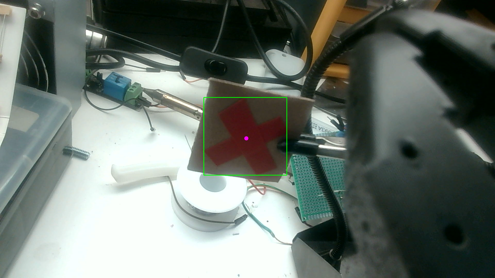
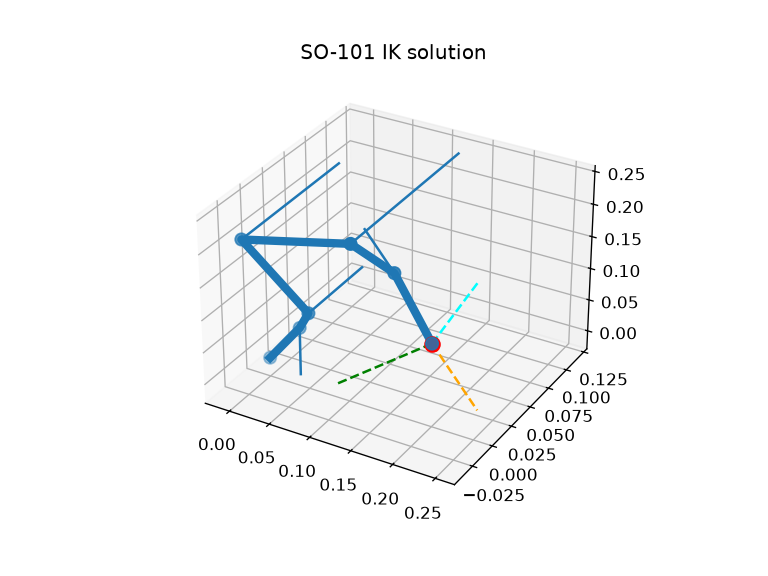

# so101-play

Hands-on experiments with the [SO-101](https://github.com/TheRobotStudio/SO-ARM100) robot arm and
[LeRobot](https://github.com/huggingface/lerobot): from raw motor pings to a vision-based
imitation policy trained on a cloud H100.

<p align="center">
  
  
</p>

## What is here

| Stage | What it does | Where |
|---|---|---|
| **Motor control** | Scan the Feetech bus, read positions, torque off (e-stop), small moves | `scripts/` |
| **Visual servoing** | Wrist camera finds a red X (HSV), P-control centers and approaches it. No calibration, no depth | `scripts/aim.py`, `track.py`, `teach.py`, `touch.py` |
| **Kinematics** | FK/IK against the calibrated URDF with IKPy, verified on the live arm | `scripts/ik_play.py`, `fk_check.py` |
| **Pixel to table** | Homography calibration: click 4+ points, map camera pixels to table mm | `scripts/homography_calibration.py` |
| **Imitation learning** | Record teleop demos, push to the Hub, train ACT / SmolVLA on a Nebius H100, roll out on the arm | `commands.sh`, `upload_to_hf.sh`, `nebius/` |

Results of the imitation-learning stage:

- Dataset: [`Chloepv/white_in_blue_circle`](https://huggingface.co/datasets/Chloepv/white_in_blue_circle), 30 episodes, 2 cameras.
- Policies: [`act_white_in_blue_circle`](https://huggingface.co/Chloepv/act_white_in_blue_circle) and [`smolvla_white_in_blue_circle`](https://huggingface.co/Chloepv/smolvla_white_in_blue_circle).
- Main lesson: ACT solved the task but failed when the object moved by 1 cm. All demos had the object in the same place, so the policy memorized a trajectory instead of using vision. Fix is data variety, not model tuning. See [docs/NOTES.md](docs/NOTES.md).

## Quick start

```bash
conda activate lerobot          # a LeRobot install (0.5.2, commit b06ad408)
cp env.example.sh env.sh        # fill in serial ports, camera indices, HF user
set -a; source env.sh; set +a

cd scripts
python ping.py                  # prints each motor position: comms OK
python limp.py                  # torque off. Keep this ready as the e-stop
python hello.py                 # tiny wrist wiggle
python track.py --live          # follow a red X with the wrist camera
```

Cloud training: see [nebius/README.md](nebius/README.md). End-to-end record → train → eval
commands: [commands.sh](commands.sh).

## Layout

```
scripts/        standalone Python scripts (each one is a single experiment)
nebius/         one CLI (nebius.sh) to bootstrap, train on, and stop a Nebius H100
docs/           lessons learned and the simulation roadmap
so101_new_calib.urdf   calibrated arm description used by the kinematics scripts
```

## Safety

The arm moves fast and fights gravity on shoulder and elbow. Clamp the base, clear the area,
and keep `python scripts/limp.py` in a second terminal.

## License

MIT
